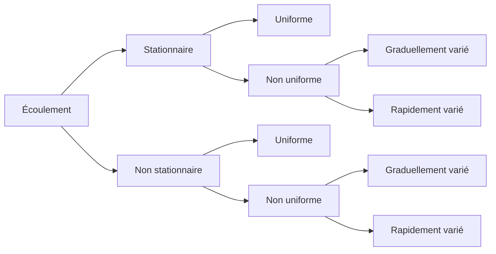

# Vocabulaire

On peut définir les écoulements suivant la variabilité des caractéristiques
hydrauliques — tels que le tirant d'eau et la vitesse — en fonction du temps
et de l'espace.

## Variabilité dans le temps

Le mouvement est **permanent** (ou stationnaire) si les vitesses $U$ et la
profondeur $h$ restent invariables dans le temps, en grandeur et en direction.
Le mouvement est **non-permanent** dans le cas contraire.

## Variabilité dans l'espace

Le mouvement est **uniforme** si les paramètres caractérisant l'écoulement
restent invariables dans les diverses sections du canal. La ligne de pente du
fond est alors **parallèle** à la ligne de la surface libre.

Le mouvement est **non-uniforme** (ou varié) si les paramètres caractérisant
l'écoulement changent d'une section à l'autre. La pente de la surface libre
diffère alors de celle du fond.

Un écoulement non-uniforme peut être **accéléré** ou **décéléré** suivant que
la vitesse croît ou décroît dans le sens du mouvement. On distingue en outre :

- **graduellement varié** : la profondeur, ainsi que les autres paramètres,
  varient **lentement** d'une section à l'autre ;
- **rapidement varié** : les paramètres changent **brusquement**, parfois avec
  des discontinuités. Cela se manifeste en général au voisinage d'une
  singularité, telle qu'un seuil, un rétrécissement, un ressaut hydraulique ou
  une chute brusque.

:::tip Exemple
Le long d'un même canal on peut rencontrer, successivement : un tronçon
uniforme, un remous graduel à l'approche d'un déversoir, une variation rapide
au droit du déversoir, un ressaut hydraulique, puis de nouveau un régime
uniforme avant une chute en sortie de canal. Un même canal alterne donc
souvent plusieurs régimes le long de son parcours.
:::

:::note Conservation du débit
Au régime **permanent**, dans un canal — que l'écoulement y soit uniforme ou
non — le **débit est conservé**, en l'absence d'apport ou de perte latérale.
:::

## Classification générale

